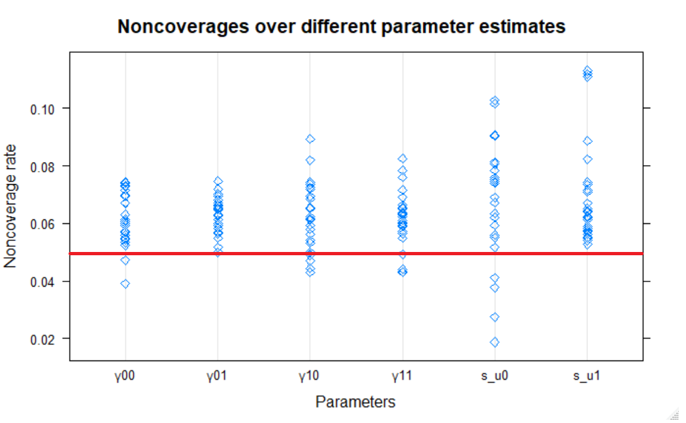

# The simulation results {#simulation-results} 

## Rate of model convergence

The overall rate of model convergence varied from $59\%$ to $100\%$.  Logistic regression was used to investigate the impact of ICC, number of groups and group size on the convergence. The rate of convergence (percent converged) significantly improved with either an increase in the number of groups or an increase in the group size. The overall rate of convergence for number of groups $30$, $50$, and $100$ was $91.76\%$, $94.87\%$ and $97.6\%$, respectively. For groups of sizes $5$, $30$, and $50$, the rate of convergence was $85.08\%$, $99.44\%$, and $99.7\%$ . For the three ICC conditions of $0.1$, $0.2$, and $0.3$ the rate of convergence was $92.1\%$, $95.91\%$, and $96.21\%$.

To explore the non-convergent samples @moineddin2007simulation examined $168$ non-convergent simulated data sets with $30$ groups and group size of $5$. After investigation, it was concluded that non-convergence results from lack of sufficient variation in both the intercept and slope.

## The bias in point estimates

Table \@ref(tab:tab1) shows the percentage relative bias of estimates for different number of groups, group size, and ICC. We found that the relative biases for the estimates of standard errors of group-level variances are comparatively bigger than the fixed effect parameter estimates. Table \@ref(tab:tab1) reveals that all the elements of the last two columns are negative numbers. That means the variance components are always underestimated. This problem of underestimation has been noted previously in simulation studies of @maas2005sufficient and @moineddin2007simulation. 
However, the biases for the estimates of standard errors of group-level residuals are less than $10\%$ for number of groups $30$ and group size $30$, and are less than $5\%$ when the size of the group was 50 and there were $50$ groups. The biases for $ICC=0.1$ are relatively higher than the ICC values $0.2$ and $0.3$.

From the results of percentage relative bias in Table \@ref(tab:tab1), our main findings are:
  
- The estimates of the regression coefficients are always unbiased, even with small sample sizes, except some cases on level-2 variable coefficients.

- The variance components are always underestimated, even with $100$ groups and $50$ individuals. However, the bias decreases with the increase in the number of groups, and with number of groups $50$ and group size $50$ this bias is less than $5\%$.

Overall, results from our simulation studies regarding the accuracy of the point estimates lead to similar conclusions as to the previous studies, in particular to those of @moineddin2007simulation and @paccagnella2011sample.

Table: (\#tab:tab1) The effect of number of groups, group size, and ICC on the percentage relative bias $(\frac{\hat{\theta}-\theta}{\theta} \times 100)$ of the estimates.

| N. of groups | Group size | ICC | \% Conv. | $\gamma_{00}$ | $\gamma_{10}$ | $\gamma_{01}$ | $\gamma_{11}$ | $\sigma_{u0}$ | $\sigma_{u1}$ |
|----------|-----|-----|-----|-------|-------|-------|-------|--------|--------|
| 30       | 5   | 0.1 | 69  | 3.54  | 5.16  | 11.71 | 3.77  | -11.33 | -16.64 |
|          |     | 0.2 | 80  | 2.09  | -3.52 | 5.24  | 7.18  | -18.02 | -16.06 |
|          |     | 0.3 | 82  | 2.25  | 7.4   | 4.78  | 8.81  | -14.14 | -12.12 |
|          | 30  | 0.1 | 99  | -0.78 | 5.36  | 3.1   | 5.56  | -10.22 | -5.8   |
|          |     | 0.2 | 99  | -0.28 | -2.43 | 2.55  | 4.68  | -5.58  | -5.7   |
|          |     | 0.3 | 98  | 0.67  | 4.3   | -2.96 | 2.07  | -6.34  | -6.31  |
|          | 50  | 0.1 | 100 | -1.22 | 0.63  | 1.62  | -0.75 | -6.6   | -5.14  |
|          |     | 0.2 | 99  | -0.56 | -1.31 | 1.08  | 0.97  | -5.51  | -5.15  |
|          |     | 0.3 | 100 | -0.26 | 0     | -1.59 | 2.8   | -5.67  | -6.34  |
| 50       | 5   | 0.1 | 76  | 0.98  | 0.4   | 2.97  | -6.18 | -16.21 | -14.61 |
|          |     | 0.2 | 89  | 1.8   | 3     | 5.15  | 6.02  | -14.21 | -16.44 |
|          |     | 0.3 | 91  | 0.12  | -1.49 | -1.6  | 5.03  | -12.63 | -17.28 |
|          | 30  | 0.1 | 100 | -0.55 | 0.41  | -2.06 | -0.04 | -6.42  | -4.06  |
|          |     | 0.2 | 100 | -0.76 | -0.58 | 0.23  | -1.6  | -4.97  | -3.97  |
|          |     | 0.3 | 99  | -0.18 | -0.94 | 3.35  | -1.64 | -3.45  | -4.8   |
|          | 50  | 0.1 | 100 | 0.33  | 0.11  | 2.23  | 2.61  | -4.91  | -3.05  |
|          |     | 0.2 | 100 | -0.13 | 2.58  | 2.08  | -0.18 | -3.78  | -3.38  |
|          |     | 0.3 | 99  | 0.27  | -0.69 | 2.48  | 4.26  | -2.66  | -3.27  |
| 100      | 5   | 0.1 | 85  | -0.69 | 1.22  | -2.4  | -2.58 | -16.36 | -13.98 |
|          |     | 0.2 | 96  | -1.04 | -0.46 | 2.23  | -0.69 | -14.46 | -14.9  |
|          |     | 0.3 | 97  | -1.83 | -2.36 | -0.07 | -1.85 | -11.74 | -18.15 |
|          | 30  | 0.1 | 100 | -0.11 | -1.44 | 0.22  | 2.14  | -4.27  | -2.72  |
|          |     | 0.2 | 100 | 0.04  | 1.41  | -0.21 | 2.21  | -2.65  | -2.59  |
|          |     | 0.3 | 100 | 0.58  | 0.23  | -0.13 | -1.03 | -2.7   | -3.32  |
|          | 50  | 0.1 | 100 | -0.01 | -0.51 | 1.04  | -0.4  | -2.85  | -2.33  |
|          |     | 0.2 | 100 | -0.07 | 2.38  | 0.47  | -2.88 | -1.93  | -1.44  |
|          |     | 0.3 | 100 | 0.96  | 0.62  | -1.49 | 0.77  | -2.04  | -1.91  |

## Non-coverage of confidence interval

Table \@ref(tab:tab2), \@ref(tab:tab3) and \@ref(tab:tab4) display the average non-coverage rates of $95\%$ profile confidence interval by number of groups, group size and ICC, respectively. Note that, we computed non-coverage rates on the standard deviation scale of variance components.

As we can see from Table \@ref(tab:tab2), non-coverage rates for fixed effect parameters range from $5.9\%$ to $6.8\%$. For the standard errors of group-level variances, non-coverage rates range from $6.3\%$ to $7.9\%$. Overall, as the number of groups increases, the non-coverage rates of $95\%$ profile likelihood interval for both the fixed effect and random effect parameters approach to the nominal $5\%$. 
Table \@ref(tab:tab3) shows that as the group size increases, the non-coverage rates approach to nominal value $5\%$.
Table \@ref(tab:tab4) reveals no pattern of non-coverage rate for the change in ICC.

Table \@ref(tab:tab5) shows the rates of non-coverage for each parameter in each simulated data set. 
Figure \@ref(fig:noncov) depicts how the non-coverage rates are scattered around the nominal rate of $0.5$ (the horizontal red line) by a dot plot.
The main findings from non-coverage rates are:
  
- The mean non-coverage rate for profile CI is $6.39\%$, and non-coverage rates are more close to $6\%$, than the nominal value $5\%$ (as Figure \@ref(fig:noncov) reveals).
- In some cases, profile likelihood confidence interval performs poorly for the variance components (e.g., the three cases for $100$ groups with $5$ individuals per group). This suggests, there might be other factors that influence the coverage rate of profile likelihood confidence interval.

Table: (\#tab:tab2) Non-coverage of the 95\% confidence interval by number of groups.

| Parameters    | N. of groups = 30 | N. of groups = 50 | N. of groups = 100 |
|---------------|-----------|-----------|-----------|
| $\gamma_{00}$ | 0.064     | 0.060     | 0.059     |
| $\gamma_{10}$ | 0.068     | 0.059     | 0.057     |
| $\gamma_{01}$ | 0.065     | 0.059     | 0.062     |
| $\gamma_{11}$ | 0.067     | 0.061     | 0.058     |
| $\sigma_{u0}$ | 0.070     | 0.064     | 0.067     |
| $\sigma_{u1}$ | 0.067     | 0.063     | 0.079     |

Table: (\#tab:tab3) Non-coverage of the 95\% confidence interval by group size.

| Parameters    | Group size = 5 | Group size = 30 | Group size = 50 |
|---------------|-------------|-------------|-------------|
| $\gamma_{00}$ | 0.066       | 0.059       | 0.059       |
| $\gamma_{10}$ | 0.069       | 0.061       | 0.054       |
| $\gamma_{01}$ | 0.065       | 0.062       | 0.059       |
| $\gamma_{11}$ | 0.064       | 0.057       | 0.066       |
| $\sigma_{u0}$ | 0.064       | 0.073       | 0.064       |
| $\sigma_{u1}$ | 0.079       | 0.068       | 0.061       |

Table: (\#tab:tab4) Non-coverage of the 95\% confidence interval by Intra-class correlation (ICC).

| Parameters    | ICC = 0.1 | ICC = 0.2 | ICC = 0.3 |
|---------------|-----------|-----------|-----------|
| $\gamma_{00}$ | 0.064     | 0.059     | 0.060     |
| $\gamma_{10}$ | 0.060     | 0.061     | 0.063     |
| $\gamma_{01}$ | 0.063     | 0.060     | 0.064     |
| $\gamma_{11}$ | 0.061     | 0.064     | 0.062     |
| $\sigma_{u0}$ | 0.056     | 0.073     | 0.072     |
| $\sigma_{u1}$ | 0.070     | 0.069     | 0.070     |

Table: (\#tab:tab5) The effect of number of groups, group size, and ICC on the non-coverageof the 95\% profile confidence interval.

| Number of groups | Group size | ICC | $\gamma_{00}$ | $\gamma_{10}$ | $\gamma_{01}$ | $\gamma_{11}$ | $\sigma_{u0}$ | $\sigma_{u1}$ |
|----------|--------|-----|-------|-------|-------|-------|-------|-------|
| 30       | 5      | 0.1 | 0.053 | 0.089 | 0.065 | 0.063 | 0.019 | 0.058 |
|          |        | 0.2 | 0.074 | 0.049 | 0.07  | 0.069 | 0.069 | 0.064 |
|          |        | 0.3 | 0.07  | 0.082 | 0.075 | 0.062 | 0.076 | 0.053 |
|          | 30     | 0.1 | 0.072 | 0.062 | 0.063 | 0.072 | 0.081 | 0.072 |
|          |        | 0.2 | 0.052 | 0.068 | 0.058 | 0.056 | 0.091 | 0.074 |
|          |        | 0.3 | 0.057 | 0.074 | 0.068 | 0.063 | 0.078 | 0.089 |
|          | 50     | 0.1 | 0.061 | 0.059 | 0.066 | 0.078 | 0.059 | 0.056 |
|          |        | 0.2 | 0.059 | 0.065 | 0.059 | 0.083 | 0.075 | 0.061 |
|          |        | 0.3 | 0.074 | 0.062 | 0.061 | 0.057 | 0.081 | 0.074 |
| 50       | 5      | 0.1 | 0.073 | 0.061 | 0.055 | 0.06  | 0.027 | 0.082 |
|          |        | 0.2 | 0.061 | 0.065 | 0.052 | 0.066 | 0.052 | 0.064 |
|          |        | 0.3 | 0.073 | 0.069 | 0.067 | 0.072 | 0.09  | 0.055 |
|          | 30     | 0.1 | 0.057 | 0.054 | 0.065 | 0.065 | 0.067 | 0.057 |
|          |        | 0.2 | 0.047 | 0.056 | 0.065 | 0.059 | 0.078 | 0.064 |
|          |        | 0.3 | 0.054 | 0.073 | 0.056 | 0.049 | 0.059 | 0.058 |
|          | 50     | 0.1 | 0.067 | 0.053 | 0.065 | 0.043 | 0.075 | 0.064 |
|          |        | 0.2 | 0.056 | 0.058 | 0.05  | 0.069 | 0.062 | 0.059 |
|          |        | 0.3 | 0.052 | 0.044 | 0.059 | 0.065 | 0.063 | 0.062 |
| 100      | 5      | 0.1 | 0.069 | 0.061 | 0.069 | 0.06  | 0.038 | 0.113 |
|          |        | 0.2 | 0.06  | 0.074 | 0.057 | 0.055 | 0.102 | 0.111 |
|          |        | 0.3 | 0.061 | 0.072 | 0.072 | 0.064 | 0.103 | 0.112 |
|          | 30     | 0.1 | 0.067 | 0.047 | 0.057 | 0.044 | 0.074 | 0.071 |
|          |        | 0.2 | 0.057 | 0.065 | 0.066 | 0.043 | 0.074 | 0.067 |
|          |        | 0.3 | 0.063 | 0.049 | 0.063 | 0.063 | 0.055 | 0.062 |
|          | 50     | 0.1 | 0.055 | 0.054 | 0.063 | 0.061 | 0.062 | 0.054 |
|          |        | 0.2 | 0.063 | 0.05  | 0.06  | 0.076 | 0.056 | 0.055 |
|          |        | 0.3 | 0.039 | 0.043 | 0.05  | 0.059 | 0.041 | 0.065 |


```{r noncov, echo=FALSE, out.width="80%", fig.cap="Dot plots of non-coverage rates of the profile likelihood confidence interval over different parameter estimates."}
 
```


